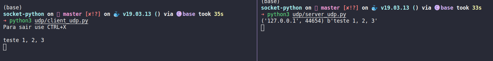

# Socket - conexão TCP e UDP em Python

## How to run
- TCP: [tcp/HOWTO.md](tcp/HOWTO.md)
- UDP: [udp/HOWTO.md](udp/HOWTO.md)

# Passagem de mensagem
O módulo Socket provê acesso a interface de socket BSD (Berkeley Software Distribution).
as variáveis HOST e PORT são onde se define, respectivamente, o endereço IP do servidor e a porta que será escutada.

## 1. Elabore um programa ilustrando a conexão socket TCP entre dois processos.

### a) Explique o código fonte utilizado
#### [código servidor TCP - server_tcp.py](./tcp/server_tcp.py):
Em `socket.socket(socket.AF_INET, socket.SOCK_STREAM)`, o método socket do módulo espera dois parâmetro. O primeiro `socket.AF_INET`, especifíca a família de endereços, que é a IPv4.
Ainda, o segundo parâmetro diz qual protocolo de conexão client-server será disponibilizada, o `socket.SOCK_STREAM` é do tipo TCP (Transmission Control Protocol).  
Em `tcp.bind(orig)`, o valor passado no método bind do objeto socket, depende da família de endereços do socket, o IPv4, definido em `socket.AF_INET`, espera uma tupla com o host e a porta.  
O método accept, em `tcp.accept`, aguarda ou bloquei uma nova conexão; é uma tupla com um objeto do tipo socket e o endereço do cliente.
E em `con.recv(1024)`, o método recv lê todos os pacotes que o cliente envia.  
Por fim, quando o cliente encerra a conexão, sai do loop while e encerra a comunicação com o método close.

#### [código cliente TCP - client_tcp.py](./tcp/client_tcp.py):
Em `tcp.connect(dest)`, o método connect recebe o IP e a porta do servidor que vai se conectar.  
E em `tcp.send(data.encode())` o send envia os pacotes que o cliente envia para o servidor.

### b) Descreva os resultados obtidos
A comunicação sempre começa com o cliente e ocorre em três etapas conhecidas como THREE-WAY HANDSHAKE.
Os pacotes trocados entre cliente e servidor são sinalizados com flags:
- O cliente envia pacote com a flag **SYN** (Synchronize)
    - Cliente: "Servidor, estou enviando uma mensagem. Dá pra sincronizar (**SYN**)?"
- O servidor responde com um pacote com as flags **SYN** + **ACK** (Acknowledgement)
    - Servidor: "Claro, sincroniza a mensagem 200 (n° de sequência do servidor) que estou enviando (**SYN**). Prossiga com a mensagem 101 (**ACK**)."
- O cliente responde com um pacote **ACK**
    - Cliente: "OK, estou enviando a mensagem 101. Prossiga com a mensagem 201 (**ACK**)"
- é mais lento que o protocolo UDP, pois tem mecanismos de verificação de integridade mais complexo.
    - Confiabilidade -> Origem e destino
- Full duplex
    - servidor e cliente podem se comunicar simultâneamente (que loucura, né)

    

Já o encerramento da conexão ocorre em 4 etapas:
- cliente ou servidor podem pedir para que se encerre
  

## 2. Elabore um programa ilustrando a conexão socket UDP entre dois processos.

### a) Explique o código fonte utilizado
#### [código servidor UDP - server_udp.py](./udp/server_udp.py):
Na criação do Socket, o `socket.socket()` pode receber até 3 parâmetros: o primeiro é a família de protocolos, o segundo é o tipo de transmissão (TCP ou UDP) e o último é o protocolo de transmissão (IPv4, IPv6).  
A função `bind`, em udp.bind(orig), está associando o endereço IP e porta para o processor servidor. Este recebe 3 parâmetros: socket associado para ser registrado, endereço local para vincular ao socket e tamanho do endereço em bytes.  
Em `udp.recvfrom(1024)` contém os pacotes que o cliente envia e quem é o cliente, o parâmetro `1024` passado é o tamanho do buffer em bytes.
Por fim, em `udp.close()` é informado ao sistema operacional para terminar o
uso do Socket.

#### [código cliente UDP - client_udp.py](./udp/client_udp.py):
Na criação do Socket, o `socket.socket()` pode receber até 3 parâmetros: o primeiro é a família de protocolos, o segundo é o tipo de transmissão (TCP ou UDP) e o último é o protocolo de transmissão (IPv4, IPv6).  
Em `udp.sendto(msg.encode(), dest)` é enviado ao servidor a mensagem do cliente; recebe como parâmetro a mensagem em bytecode e uma tupla que representa o endereço IP e a porta do servidor local.  
Ao fim, `udp.close()` informa ao SO para finalizar o uso do Socket.

### b) Descreva os resultados obtidos
Não é um protocolo voltado a conexão, pois não estabelece conexão entre origem e o destino.  
Não há verificação de integridade, assim serve para serviços que a perda de algum pacote não com prometa o conteúdo, como trasmissão de áudio, transmissão de vídeo.  
Também, um servidor consegue transmitir pacotes para vários clientes, assim é capaz de enviar grande massa de dado em pequeno espaço de tempo.

